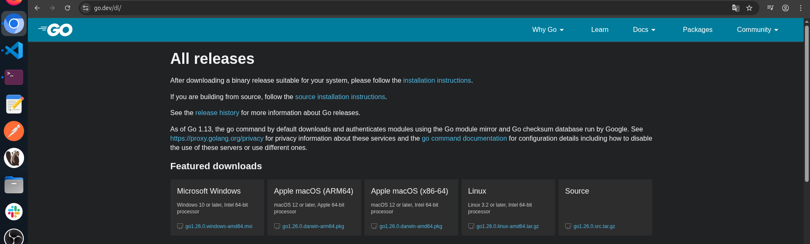
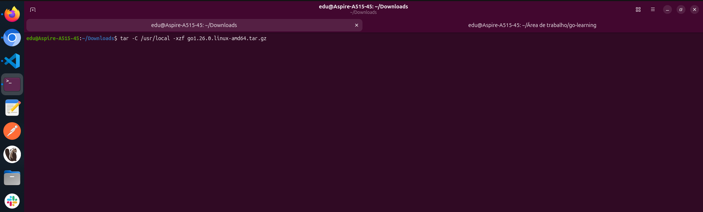
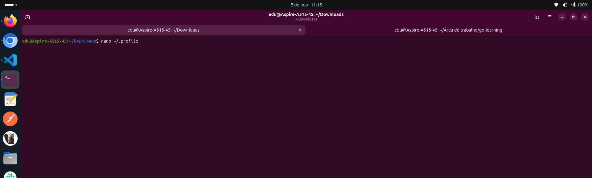
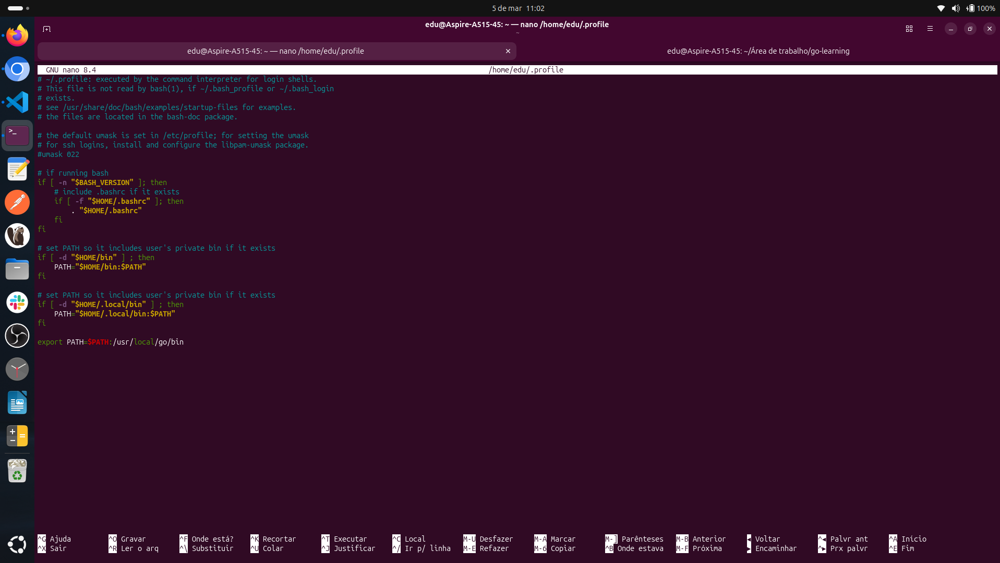
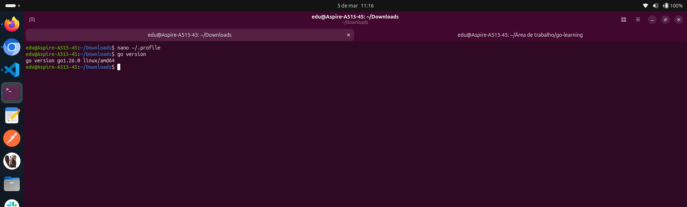

# GO-LEARNING

> - [GET STARTED](https://go.dev/doc/)

  
> - [COURSE](https://www.udemy.com/course/aprenda-golang-do-zero-desenvolva-uma-aplicacao-completa/)

 # Documentação do meu aprendizado em Go, seguindo um curso prático do zero.

I - **Instalação do Go**

Sistema Operacional: **Linux (Ubuntu 25.10)**
**verificar compatibilidade na página de [download](https://go.dev/dl/)**


1. **Download**

Acesse o [link](https://go.dev/dl/) e selecione a versão apropriada para seu sistema operacional (no meu caso: go1.26.0.linux-amd64.tar.gz)



2. **Extração do arquivo**
Navegue até a pasta Downloads e extraia o arquivo para **/usr/local**

```bash
cd ~/Downloads
tar -C /usr/local -xzf go1.26.0.linux-amd64.tar.gz
```

 

**Obs:** A documentação oficial recomenda usar rm -rf /usr/local/go && tar -C /usr/local -xzf go1.26.0.linux-amd64.tar.gz para versões subsequentes. Na primeira instalação, não é necessário remover versões anteriores, até pq você nem vai possuir nada mesmo..

3. **Configurar variável de ambiente**

Edite o arquivo .profile para adicionar o caminho do Go ao PATH:
```bash
nano ~/.profile
```
Adicione a seguinte linha ao **FINAL** do arquivo:
```bash
export PATH=$PATH:/usr/local/go/bin
```

**Para sair do nano:**

Pressione **Ctrl + O**, depois **Enter** para salvar
&
Pressione **Ctrl + X** para sair

4. **Verificar instalação**

Abra um novo terminal (ou reinicie a máquina) e execute:
```bash
go version
```




**Obs:** É recomendável reiniciar a máquina após a configuração para garantir que todas as variáveis de ambiente sejam carregadas corretamente.

tudo o que eu expliquei pode ser encontrado na [documentação](https://go.dev/doc/install) 

